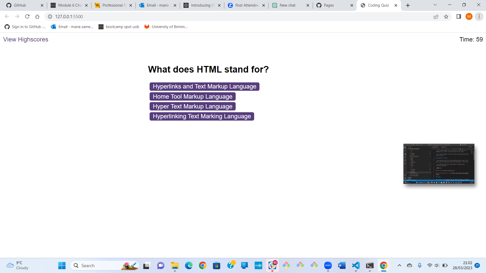

# quiz-challenge

## Description

I wanted to build a timed quiz on JavaScript fundamentals that stores high scores,so that I can gauge my progress compared to my peers.

## Usage

Provide instructions and examples for use. Include screenshots as needed.

To add a screenshot, create an `assets/images` folder in your repository and upload your screenshot to it. Then, using the relative filepath, add it to your README using the following syntax:

    md
    
    

